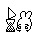
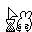
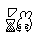
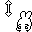

# ya5hu
 
- [Twitch](https://www.twitch.tv/ya5hu)
- [Twitter](https://twitter.com/shubewbz)

## Download & Installation
These will only work for windows.

- Go to the [release page](https://github.com/mzntori/cursors/releases/tag/ya5hu).
- Download `ya5hu_cursors_win.zip` and unpack the .ani files it contains in some folder where you won't delete them.
- To activate them follow [this Tutorial](https://www.youtube.com/watch?v=jTfSGtudh84) which will work on win10 and win11.
- File names with `alt` at the end indicate that they can be used as an alternative option to the default cursor. It is recommended to stay consistent within one cursor style as it might look weird otherwise. The cursor type `Alternative selection` can be chosen from the other two unused `Normal Selection` files.

## Preview

### Normal Select/Alternate Select

### Help Select

### Working in Background

### Busy

### Precision Select

### Text Select

### Handwriting

### Unavailable

### Resizing

### Move

### Link/Location/Person Select

